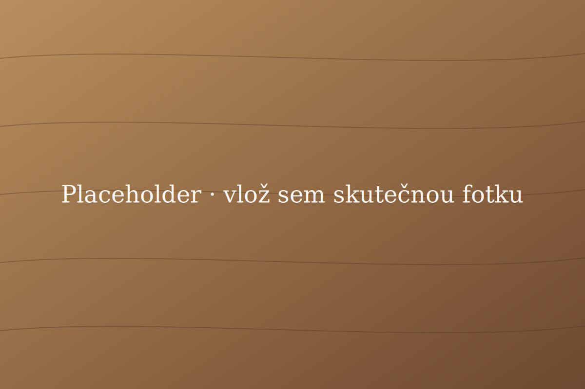

## Zadání

Klient si přál kuchyň, která vydrží generace — kombinaci poctivého řemesla
a&nbsp;moderního provozu. Vybrali jsme masivní dub z&nbsp;českých lesů a&nbsp;navrhli
linku s&nbsp;ručně dělanými rámovými dvířky.

## Co jsme řešili

- bezúchytkové otevírání kombinované s frézovaným úchopem
- integrované spotřebiče značky Bosch
- pracovní desku z dubu ošetřenou tvrdým voskem
- ostrov s odsávačem skrytým ve stropě

## Výsledek

Kuchyň je v provozu od jara 2025 a klient si pochvaluje hlavně tichý chod
zásuvek Blum a teplý povrch dřeva, který v běžné provozu hezky stárne.
